# AP Tracker Demo Storyboard

Use these live captures as the visual backbone for a ~5 minute demo.

## 1. Sign In / Landing
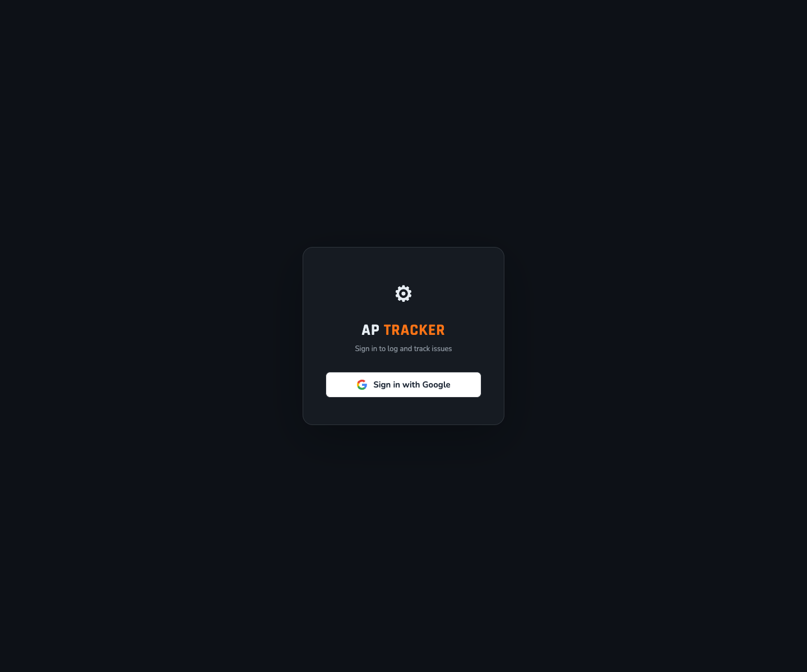

**Caption:** “AP Tracker opens to a plant-aware workspace with quick sign-in and a progress summary on the side.”

## 2. Main Dashboard
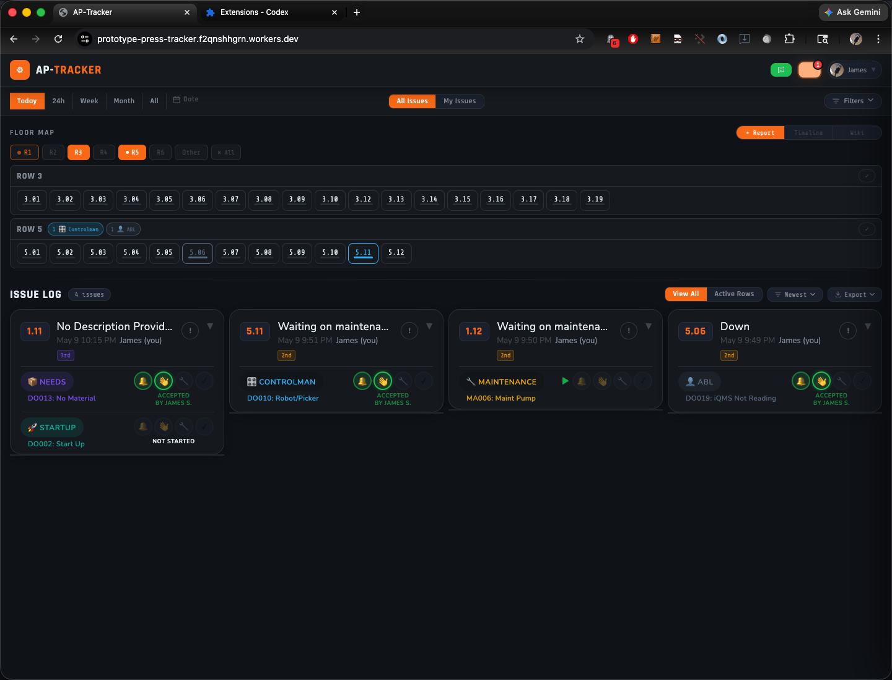

**Caption:** “The main view combines the floor map and issue log so operators always have context and live work in one place.”

## 3. Filters Open
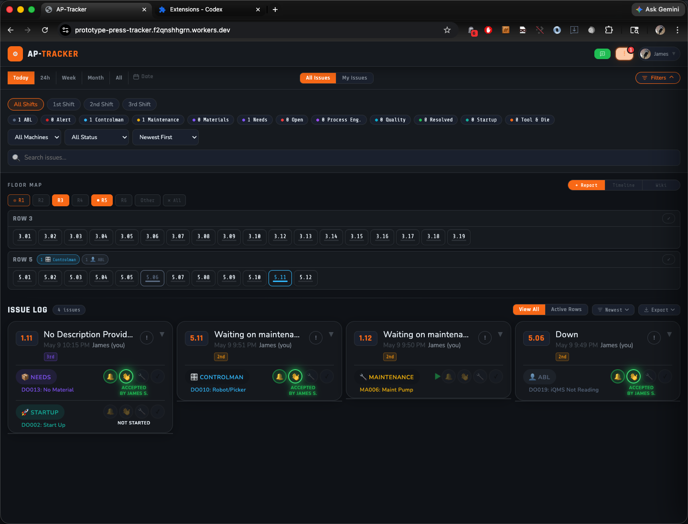

**Caption:** “Filters make it easy to narrow by shift, machine, status, or search without leaving the floor view.”

## 4. Log Issue
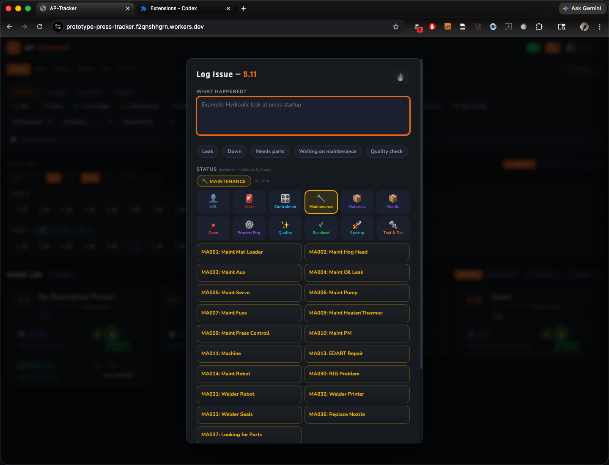

**Caption:** “The issue composer is built for fast logging, with status, subcategory, and photo-friendly workflow controls.”

## 5. Timeline Mode
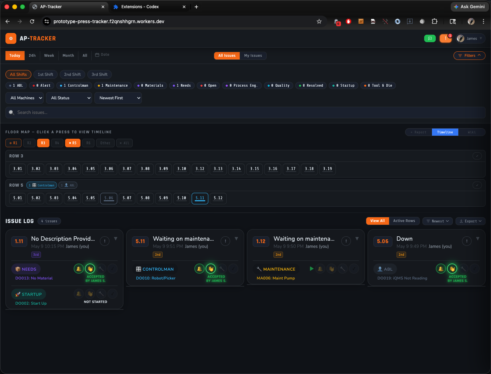

**Caption:** “Timeline mode shifts the map into history mode so teams can review what happened on a press over time.”

## 6. Shared Library
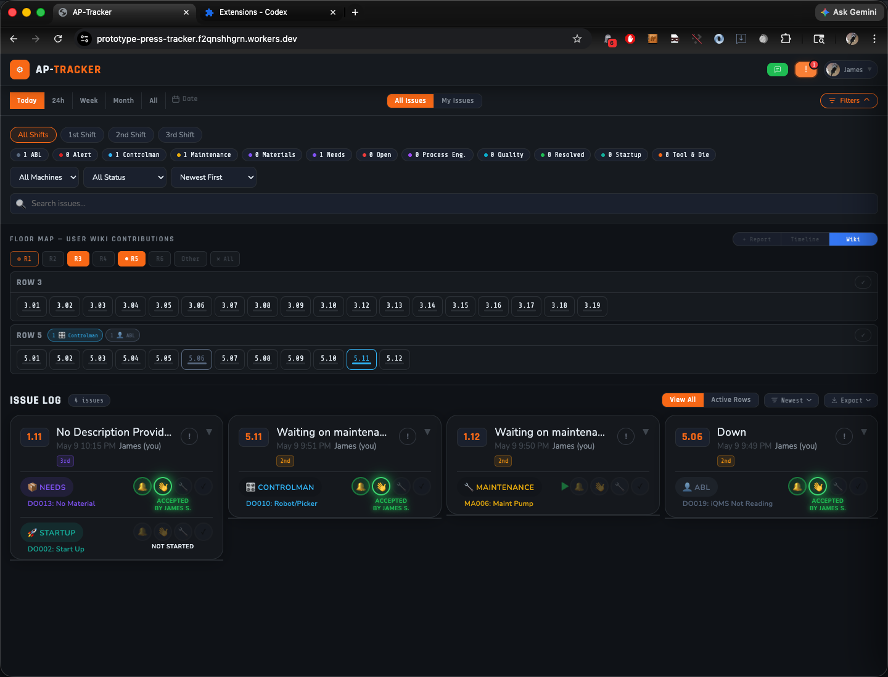

**Caption:** “Shared Library turns the floor map into a shared knowledge surface for press notes and contributions.”

## 7. Messages
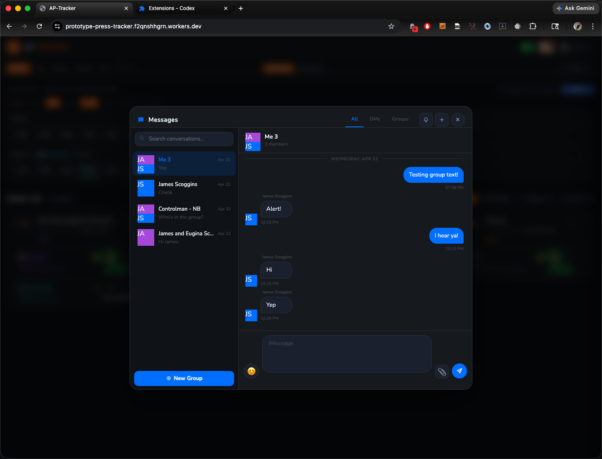

**Caption:** “The messaging modal keeps team communication inside the same plant workflow.”

## 8. Export
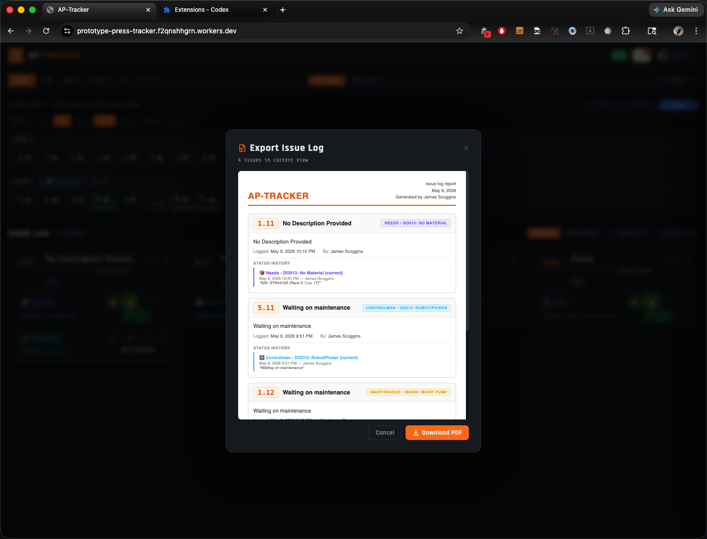

**Caption:** “Export creates a report-ready issue log preview and makes PDF handoff straightforward.”

## 9. Progress Drawer
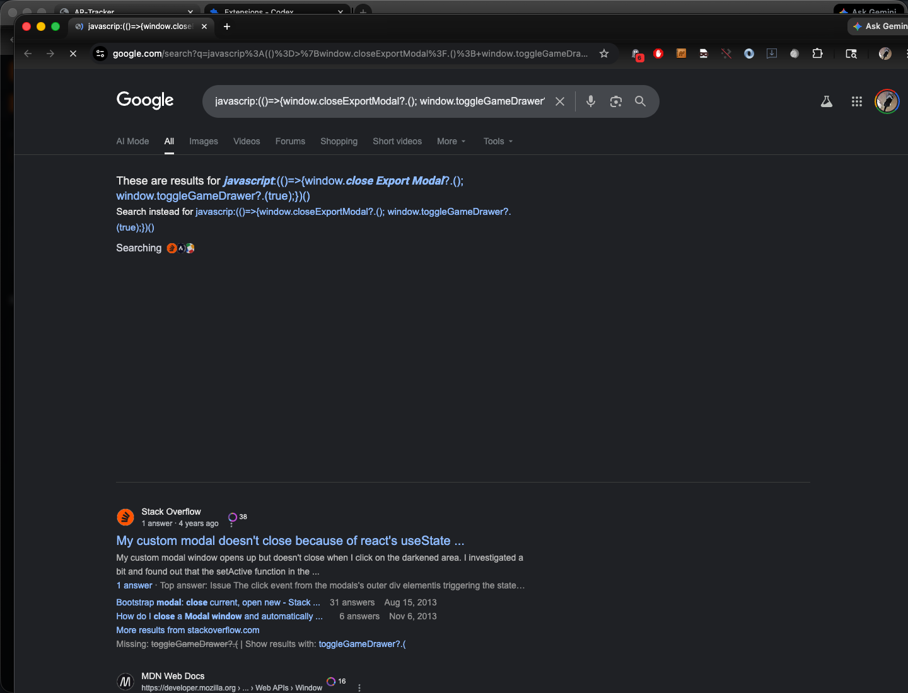

**Caption:** “The progress drawer shows XP, streaks, missions, badges, and store items to reinforce engagement.”

## 10. Theme Editor
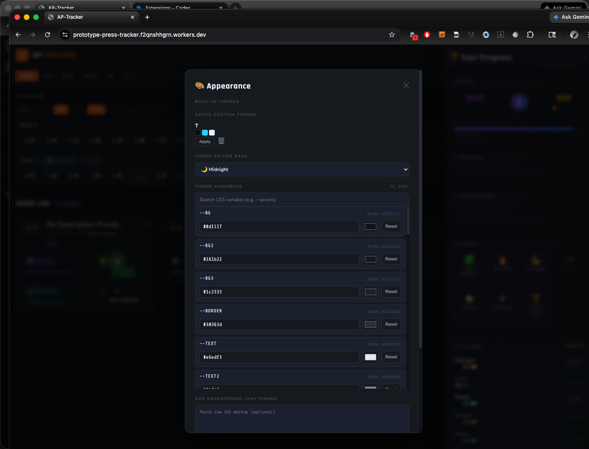

**Caption:** “Appearance controls let the plant customize the look and feel without changing the underlying workflow.”

## 11. Tutorial Overlay
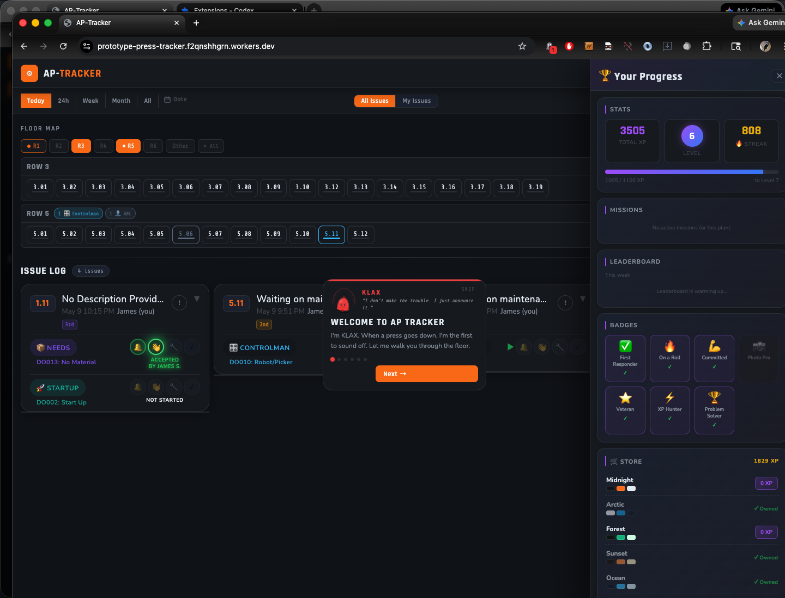

**Caption:** “The built-in tutorial provides an onboarding path for new users right in the app.”

## 12. Admin Portal
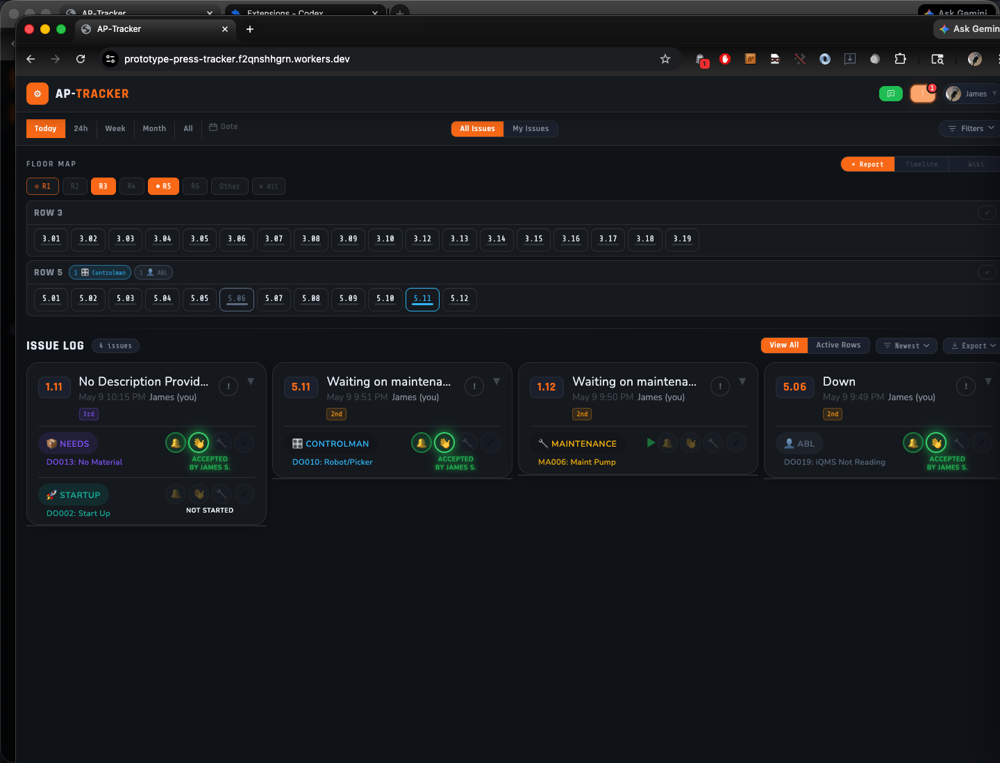

**Caption:** “The standalone admin portal manages plant-level configuration, keeping ops control separate from floor use.”

## Suggested Flow

1. Sign In / Landing
1. Main Dashboard
1. Filters Open
1. Log Issue
1. Timeline Mode
1. Shared Library
1. Messages
1. Export
1. Progress Drawer
1. Theme Editor
1. Tutorial Overlay
1. Admin Portal

## Short VO Lead-ins

- “Here’s the live floor view.”
- “Now I’ll narrow the list.”
- “Logging a problem takes just a moment.”
- “We can trace the history too.”
- “The app also supports shared notes and messages.”
- “When it’s time to hand off, export is built in.”
- “Engagement is part of the product, not an afterthought.”
- “Admins can tune the plant without touching the floor workflow.”
